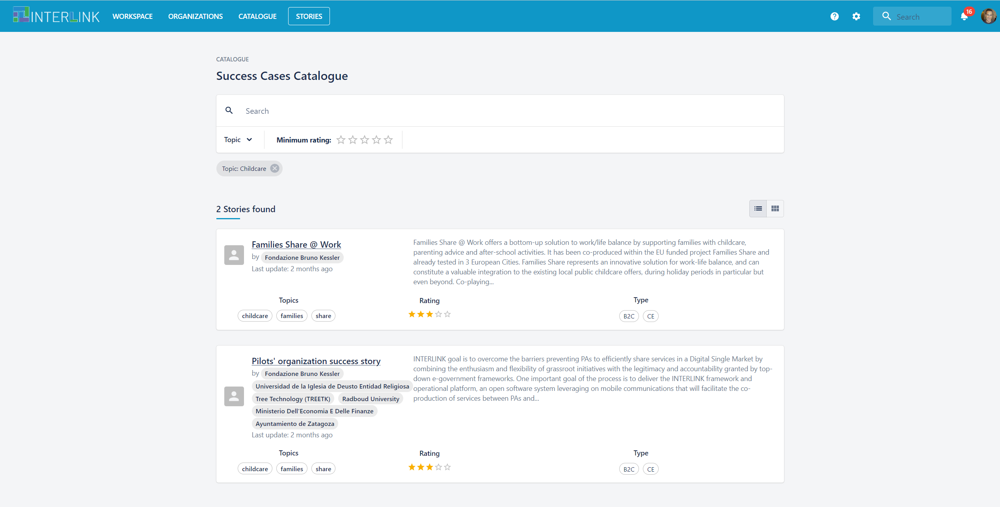
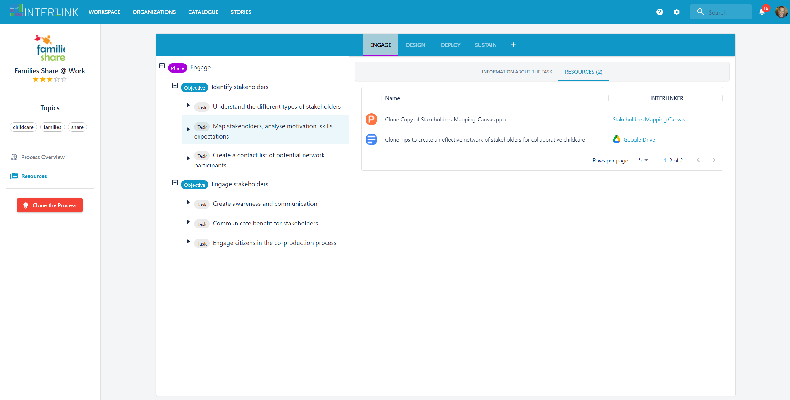
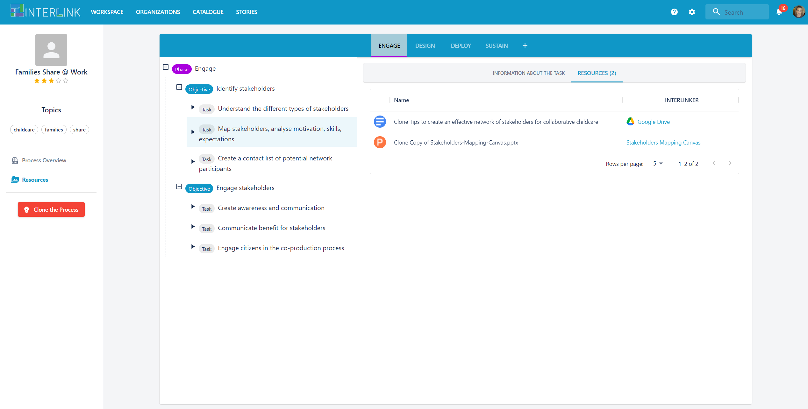
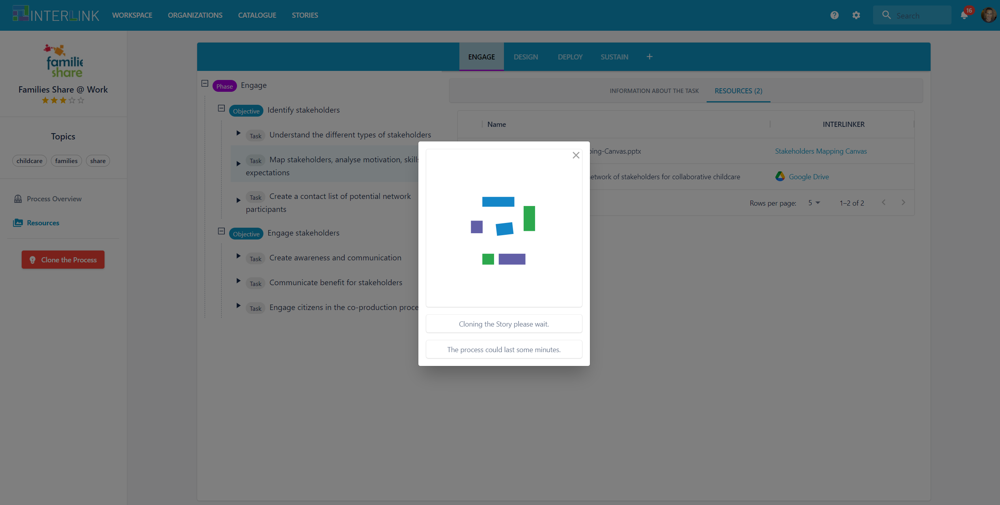
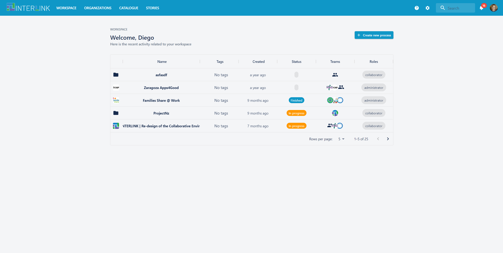

# Catalogue of Sucess Cases
The [Success cases catalogue](https://demo.interlink-project.eu/stories) provides a one-stop-shop to review co-production processes' success cases. It has been populated with good examples of co-production processes which can serve as reference for those embarking in the task of setting up and configuring a new co-production process.  

You may access the Success Cases catalogue by clicking on STORIES top menu option. This will give you access to a new screen where you can perform browsing, filtering and selection of Success Cases. Next some examples of the actions that you can currently carry out in the Success Cases' catalogue:
- Enter in the catalogue of Success Cases by clicking on STORIES top menu option:
	
- Filter by selecting options on Topic filter or the minimal rating associated to a success case. 
	
- Review contents of an Success Cases by clicking on the title of one of the displayed Success Cases. You main review what offers the selected Success Cases by visiting the "Process Overview" left hand side menu option.
	
-  You may see the actual process behind this success story by clicking on the left hand side menu option "Resources"
	
-  You may clone the co-production process behing a Success Case by clicking on red button "Clone the process"
		
- As result of the process cloning a new process appears in the Workspace view, notice the appearance of new process "Clone of_ Catalogue Publication of_Families Share @ Work" at the end of the list
		

