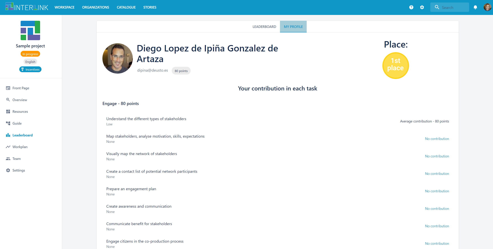

# Leaderboard of a co-production process

The LEADERBOARD view consists of LEADERBOARD and/or MY PROFILE sub-views. The former is always seen by process admins, but may be seen by other process participants, if when configuring the incentive system for a process, it is indicated so. The latter is seen by all users who have made contributions to a process. 

The LEADERBOARD sub-view showcases the overall standings of a co-production process, i.e. it depicts the points gained by each participant in a co-production process. The bigger the points assigned to a person the higher the contribution of such person to the co-production process has been. Users are able, through the Guide view when selecting a specific resource, to declare (claim) their contribution towards the achievemnt of a given resource. Process admins, based on the associated complexity level of a task, and the level of contribution of participants/contributors the resources generated for a given task perform the distribution of points among participants in such task. When a co-production process concludes, the process admins may decide who can be rewarded, the podium is only to show the contribution level of each participant into the co-production process. The reward is external from this platform and a responsability of the admins.

As mentioned, depending on the settings of the reward system, a given co-production process will see both the global leaderboard and their profile, or, exclusively their profile. Notice that the "MY PROFILE" sub-view of the leaderboard, shown for every user, summarizes what have been the contributions of a user in a given process, i.e. in what tasks she has taken part and how many points she has got for her participation in each task of the co-production process. Besides, this sub-view indicates the position of this user in comparison with other collaborators, in terms of her contribution level compared to others. 

