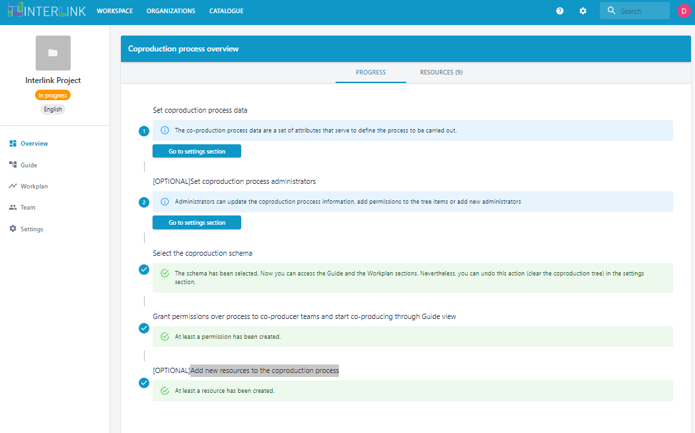
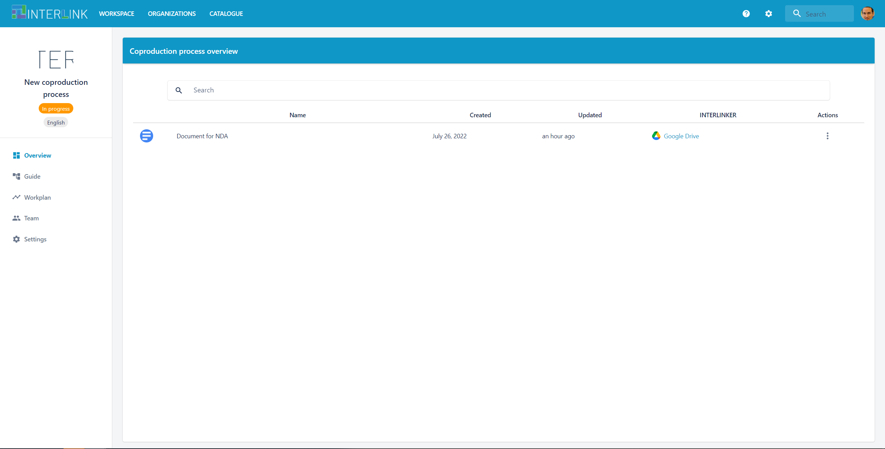
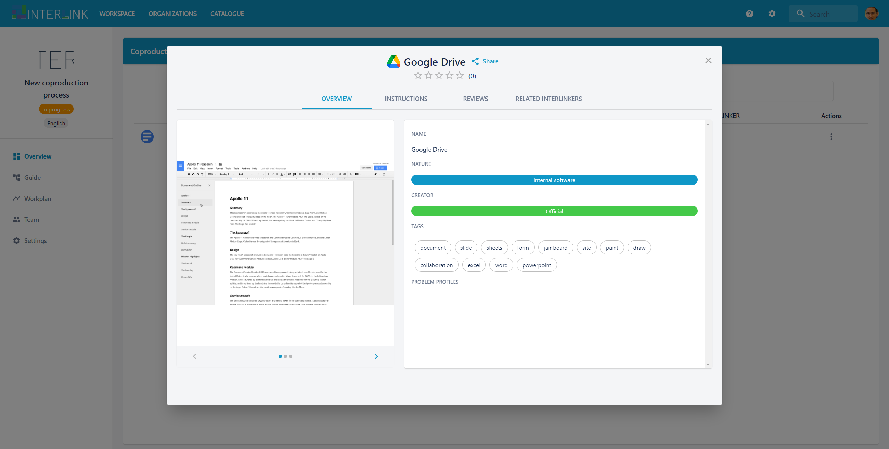
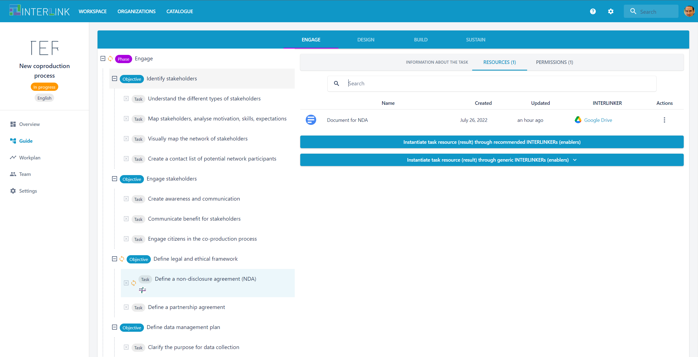
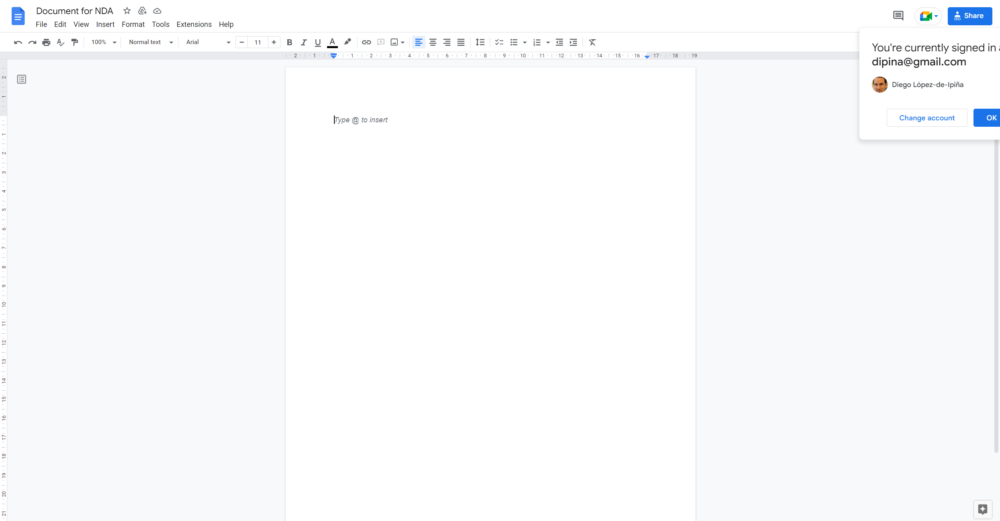

# Overview of a co-production process

The Overview view is one of the eight co-production process visualizations available, namely [FrontPage](/docs/en/coproductionprocess-frontpage.html), [Overview](/docs/en/coproductionprocess-overview.html#), [Resources](/docs/en/coproductionprocess-resources.html#), [Guide](/docs/en/coproductionprocess-guide.html), [Leaderboard](/docs/en/coproductionprocess-leaderboard.html), [Workplan](/docs/en/coproductionprocess-workplan.html), [Team](/docs/en/coproductionprocess-team.html) and [Settings](/docs/en/coproductionprocess-settings.html) views.  

The Overview view is in charge of showing the ongoing activity on a given co-production process. Inside you can find two sections, the first is PROGRESS and the second is NOTIFICATIONS. 
The PROGRESS sub-view (only available for process admins) provides a setup wizard for a co-production project where several process management activities can be performed, e.g. manage organizations or teams linked to a process, change the process' settings, choose its associated co-production schema or set up team member permissions or incentives scheme for such process. Each wizard's step allows an admin to access directly to the section where such specific action takes place. The list of actions are:
- Create or select organizations and teams for a process
- Set coproduction process metadata and administrators
- (Optional) Identify the type of co-production process 
- Select the coproduction schema, i.e. the phases, objectives and tasks it will be made of. 
- (Optional) Set up a reward system for the co-production process
- Grant permissions over the whole process or particular process' schema's branches to co-producer teams and start co-producing through Guide view
- (Optional) Add new resources to the coproduction process

NOTIFICATIONS sub-view displays the current set of resources instantiated. The following actions can be performed over the resources listed:
- Visit the INTERLINKER with which a given resource has been created, by clicking on the link with the name of the INTERLINKER.
- Visit the task a given resource has been created with, by clicking on the three "."s under "Action" column of the table of resources and then select "Go to the task" menu option in the pop-up menu. 
- Open the corresponding resource by clicking on the hyperlinked name of the resource or by clicking on the three "."s under "Action" and then select "Open" menu option

