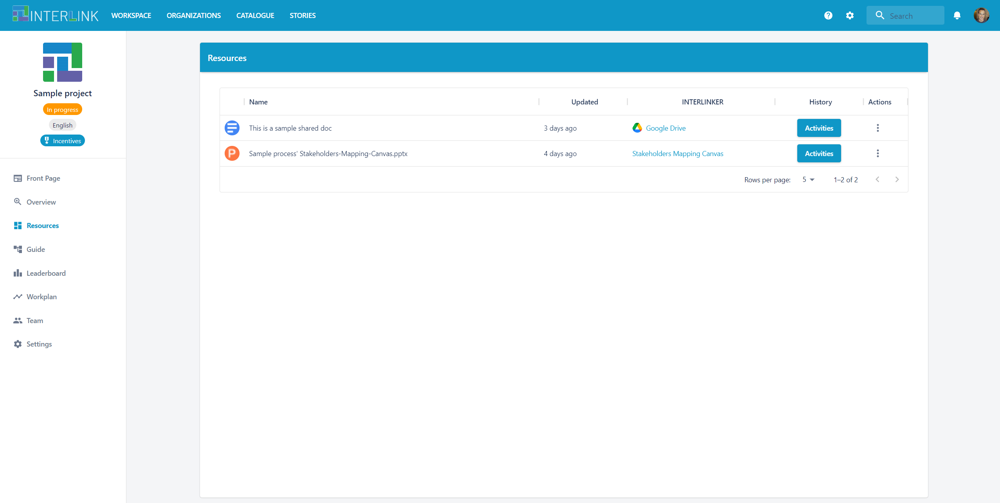
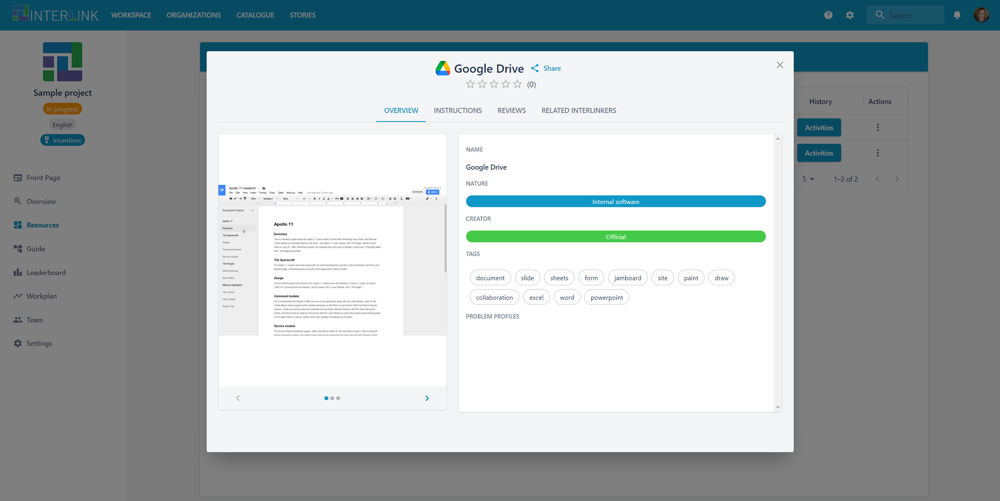
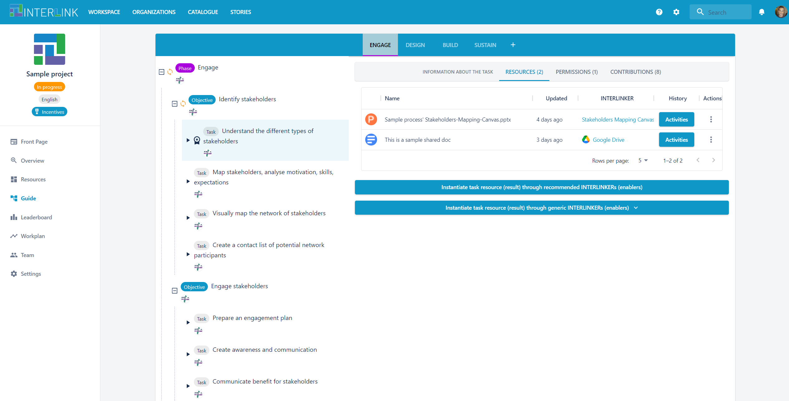
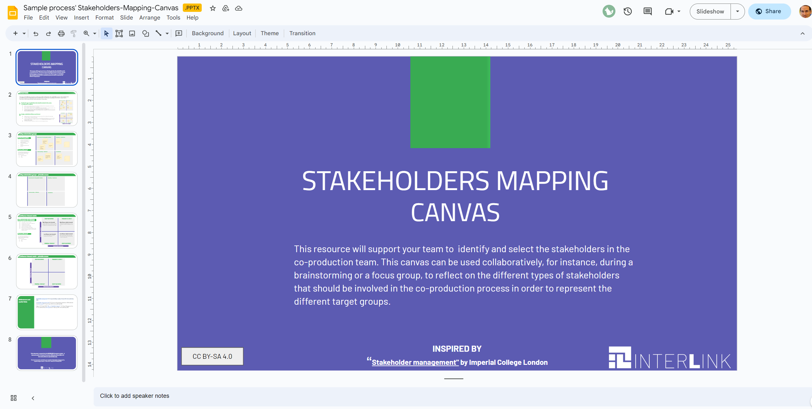

The RESOURCES view displays the current set of resources instantiated within a coproduction-process. The following actions can be performed over the resources listed:
- Visit the INTERLINKER with which a given resource has been created, by clicking on the link with the name of the INTERLINKER.
- Visit the task a given resource has been created with, by clicking on the three "."s under "Actions" column of the table of resources and then select "Go to the task" menu option in the pop-up menu. 
- Open the corresponding resource by clicking on the hyperlinked name of the resource or by clicking on the three "."s under "Actions" and then select "Open" menu option
- Click on the Activities button to see what actions have been carried out over a resource of co-production process, i.e. who created it, what contribution/modification another process' team's member has performed over the resource and so on.

