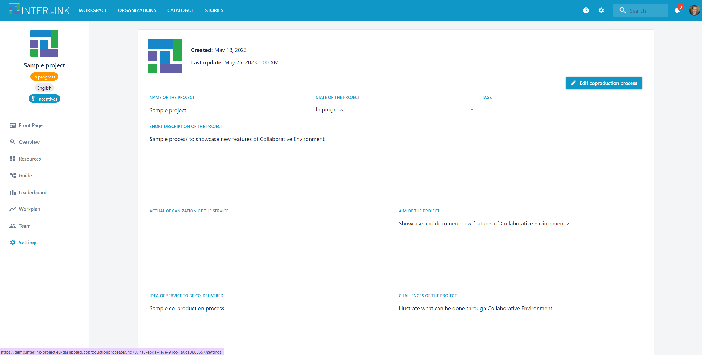
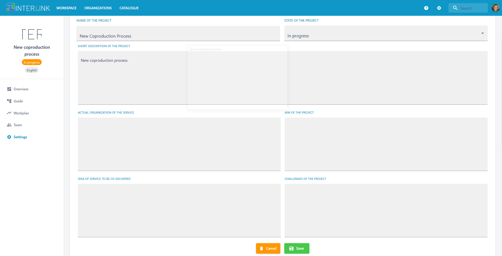
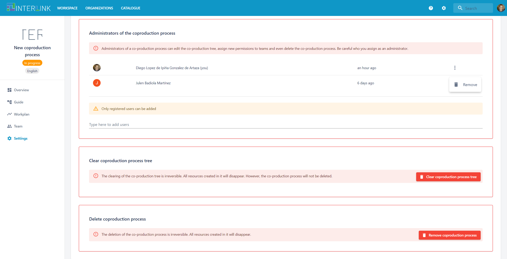
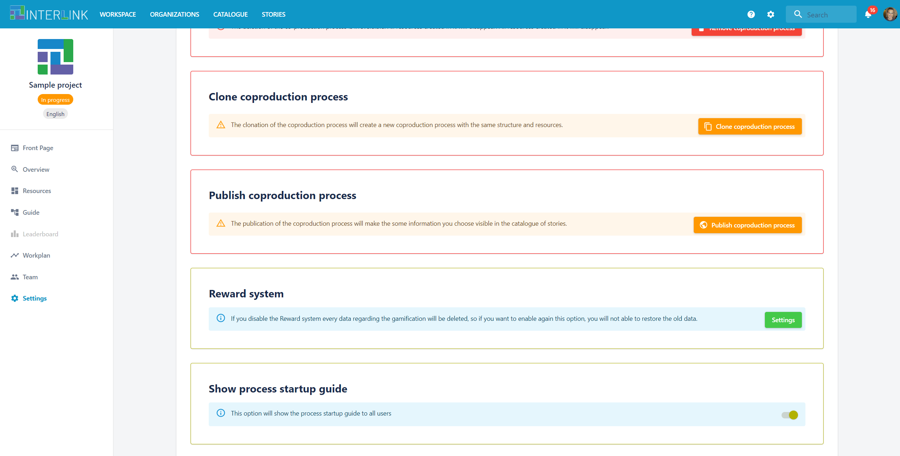
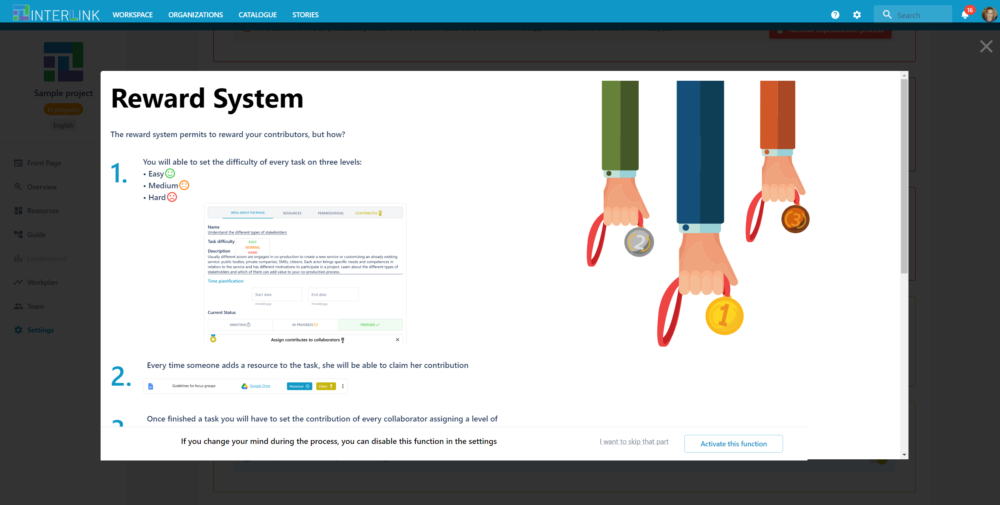
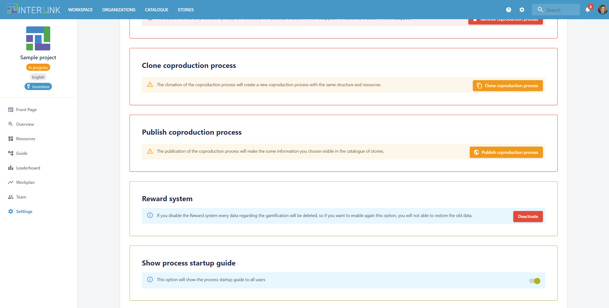
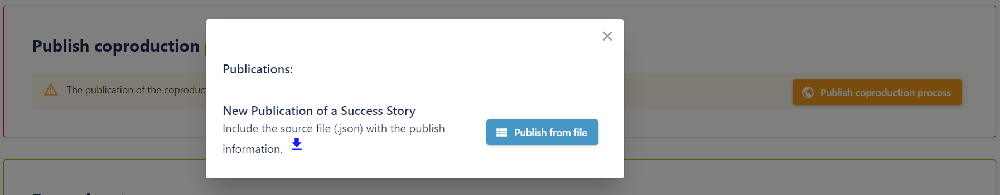

# Settings of a co-production process

Once you have configured a co-production process, you can always update its details by clicking on the **Settings** menu option on the left hand-side menu. Then, click on the blue button "Edit coproduction process", after the fields of the process, to start editing the project details. Finally, hit on the button "Save" to save changes or "Cancel" to cancel them. 

The following details can be updated per project:
- Logo of the coproduction process
- Name of the coproduction process 
- Short description of the coproduction process
- Actual organization of the service
- Aim of the coproduction process
- Idea of service to be codelivered
- Challenges of the coproduction process

As we can see, this section allows for the definition of the purpose of a coproduction process, establishing how will be managed and what challenges it will need to solve. Notice the button "Edit coproduction process" to activate modification of coproduction process' metadata fields. 

Besides, the co-production process' SETTING view allows for the following actions to be taken over a process:
- Management of administrators of the coproduction process, i.e. process administrators can be deleted or added. Only a user who is an admin of a co-production process can carry out this action.
- Clear co-production process tree. The co-production tree assigned to a co-production process can be removed by the process administrators. This will force the association of a new co-production tree schema before co-production process activities can be resumed. 
- Delete co-production process. This action again can only be performed by the admin of a coproduction process. It will result on the removal of the current coproduction process with the associated removal of all its assets. 
- Clone co-production process. This action again can only be performed by the admin of a coproduction process. It will result on the cloning of the present coproduction process so that a brand new one may leverage from teh schema, resources, teams or permissions of the old one. The new process created after cloning may then tuned or adapted to the purpose of the new co-production process, e.g. by trimming the co-production tree or creating new branches (tasks, objectives or phases) in the newly created process.  
- Publish co-production process. This admin action results in the creation a new entry in the STORIES catalogue. Apart from the process, a success case requires additional metadata which must be provided in the form of a JSON file. The environmement allows the user to download a sample of such file which can be customized to the success case to be published. Notice that within the success case the source process is cloned. However, no personal information, e.g. teams and permissions associated to their members in the process are replicated. 

Next screenshot shows how highlighted by a red frame appear destructive administrative tasks that coproduction process administrators can apply over a coproduction process, namely "Clear co-production process tree" or "Delete co-production process". For all the action buttons with red background, a pop up window is shown to request the administrator to confirm such destructive action.    

Notice that in yellow background appear those constructive actions that from an existing process either create a copy of it ("Clone co-production process") or publish it the "Use Case Catalogue". Finally, in blue background appear the "incentivization" and "guiding" actions configurable in a process. 

The section "Reward System" allows a process admin to set up incentization in that process. The green button "Settings" 

A pop up window appears which allows a co-production process admin to configure whether a "Leaderboard" and a "My profile" boards will be shown to every user or only the "My profile" board for every specific user will be shown. By clicking on "Activate this function" button incentives are activated for this process. 

Notice in the following snapshot how "Incentives" label appears under the process name and how the red button "Deactivate" appears now in the "Reward system" section of settings. 

The section "Show process startup guide" allows the verbose wizard shown in the ["Overview" view](/docs/en/coproductionprocess-overview.html) to be deactivated, i.e. its tab "PROGRESS" disappears.

